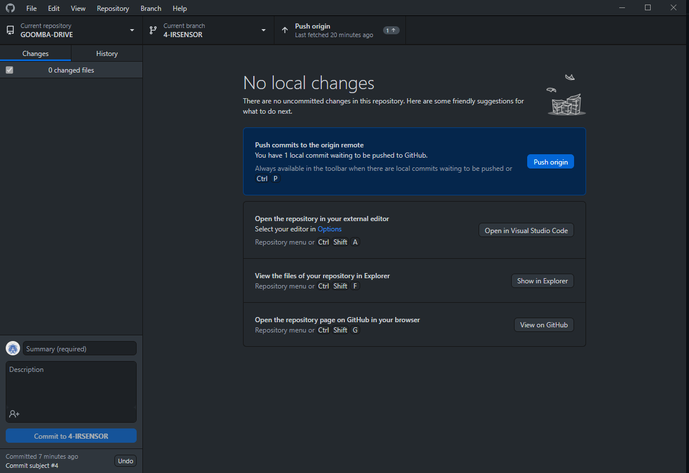

## How to fix issues in the program
When dealing with one of the issues on the github repository, create a separate branch that has a title that references the issue and has a breif description of what it is. For example, if you are going to fix issue number 4, you would create a branch by going to the main page and create a branch by typing in that textbox with the title of 4-IR_SENSOR. Do not make changes directly to the main branch directly.

- **NOTE**: Once you have created a branch via this method, it takes the *version of main at that time* and clones it into the branch. If someone updates the main branch  before you are able to push your changes into the main branch, you want to pull that new version of the main branch into your branch so that the code will merge properly. **DO NOT** push to the main branch if the main branch has been changed before your changes and you have not pulled the changed main branch into your branch. To update your branch, click this:

- **NOTE #2**: ***always*** click 'Fetch origin' then 'Pull origin' when launching desktop github.

To then make changes to solve your specific issue in your dedicated branch, go to the github desktop and choose your current branch. Click on this button and select your branch.

Select your branch

If you get this prompt, this means that you have made changes to the file that haven't been committed to that branch so the changes are only local. If you want to pick up where you left off on that branch later, leave the changes to that branch and restore them when you get back to that branch.

From there, you should be able to go back and change the branch without issue. You should see something like this:

From there, you are free to make your changes in your section of the code. Once you are satisfied with all of the changes, save the changes and then click on this tab on the left in VSCode

From here, to send the changes to the main branch, click stage changes to queue those to the pull request. Then click the check mark above to confirm the changes you have staged.

At the top, you will be required to send a message along with the commit. Best practice is to set it as `commit subject #(issue number)` to describe what  was fixed and link to the issue it pertains to. Once you have sent that, go back to the Github Desktop and gone to the changes screen, you want to click 'Push origin'

Then click create pull request. You should be sent to a page on the website for the pull request. Things to include in the pull request:

From there, the request will be created and evaluated by someone else in the group and can then be merged with the main program.
